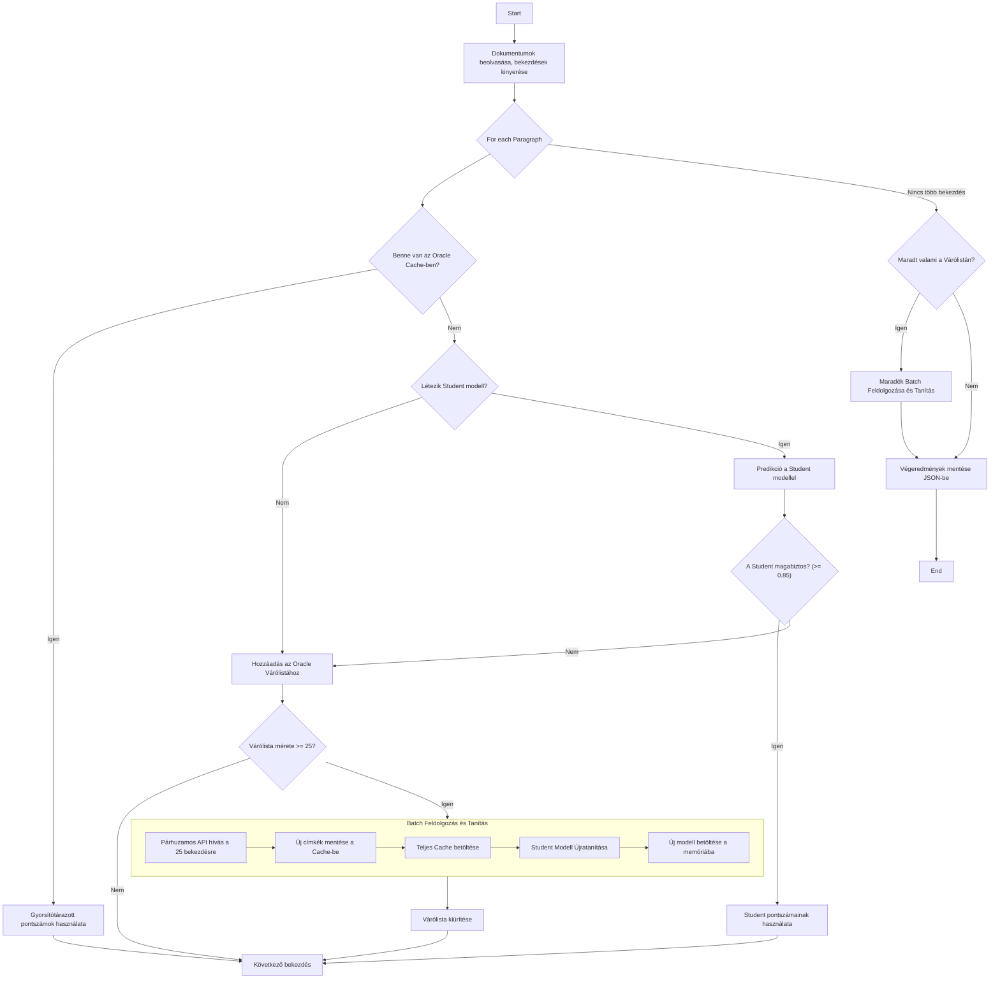

# Active Learning Document Classifier

Ez a projekt egy intelligens dokumentum-osztályozó rendszer, amely az aktív tanulás (Active Learning) módszerét alkalmazza. A célja, hogy különböző formátumú (PDF, DOCX, PPTX) dokumentumokból kinyert szöveges bekezdéseket automatikusan, előre definiált témák szerint kategorizálja, miközben minimalizálja a költséges API hívások számát.

## Főbb Jellemzők

-   **Aktív Tanulási Ciklus:** A rendszer egy gyors, helyi "diák" (Student) neurális hálót és egy nagy teljesítményű "orákulum" (Oracle - Google Gemini API) modellt használ. Csak akkor fordul a drága orákulumhoz, ha a diák modell bizonytalan, majd az így kapott új tudással dinamikusan újratanítja a diákot.
-   **Dinamikus Újratanítás:** A diák modell a futás közben, 25-ös csomagokban (`RETRAIN_TRIGGER_COUNT`) gyűjtött új adatokból automatikusan újratanul, így folyamatosan okosabbá és magabiztosabbá válik.
-   **Párhuzamos API Hívások:** Az aszinkron feldolgozásnak köszönhetően a rendszer képes egyszerre több API kérést is elküldeni, jelentősen csökkentve a várakozási időt.
-   **Univerzális Dokumentumfeldolgozás:** Képes `.pdf`, `.docx`, és `.pptx` fájlok szöveges tartalmának kinyerésére és intelligens bekezdésekre bontására.
-   **Központosított Konfiguráció:** Minden fontos paraméter (modellnevek, elérési utak, küszöbértékek) egyetlen helyen, a `config/constants.py` fájlban módosítható.

## A Rendszer Működése

A projekt lelke a "diák-orákulum" modell. A diák egy kicsi, gyors neurális háló, ami a helyi gépen fut. Az orákulum a nagy teljesítményű Gemini Pro modell. A cél, hogy a diák a lehető legtöbb munkát elvégezze, és csak akkor kérjen segítséget a "bölcs" orákulumtól, ha abszolút szükséges. A folyamat a következőképpen néz ki:

### Folyamatábra

*(Megjegyzés: A lenti diagram megjelenítéséhez olyan Markdown-megjelenítő szükséges, amely támogatja a Mermaid.js szintaxist, mint például a GitHub.)*



## Fájlstruktúra

```
.
├── config/
│   └── constants.py         # Központi konfigurációs fájl
├── data/
│   └── content/             # Ide kerülnek a feldolgozandó dokumentumok
│   └── main_topics_subtopics.json # A lehetséges kategóriák listája
├── models/                  # Ide menti a rendszer a tanított diák modellt
├── utils/
│   ├── active_learning_pipeline.py # A fő feldolgozási logika
│   ├── create_training_data.py   # Szkript a kezdeti tanítóadatbázis generálására
│   ├── train_student_model.py    # Szkript az első diák modell betanítására
│   └── ...                  # További segédmodulok
├── main.py                  # A program indítófájlja
├── .env                     # API kulcs és egyéb környezeti változók helye
└── requirements.txt         # Szükséges Python csomagok listája
```